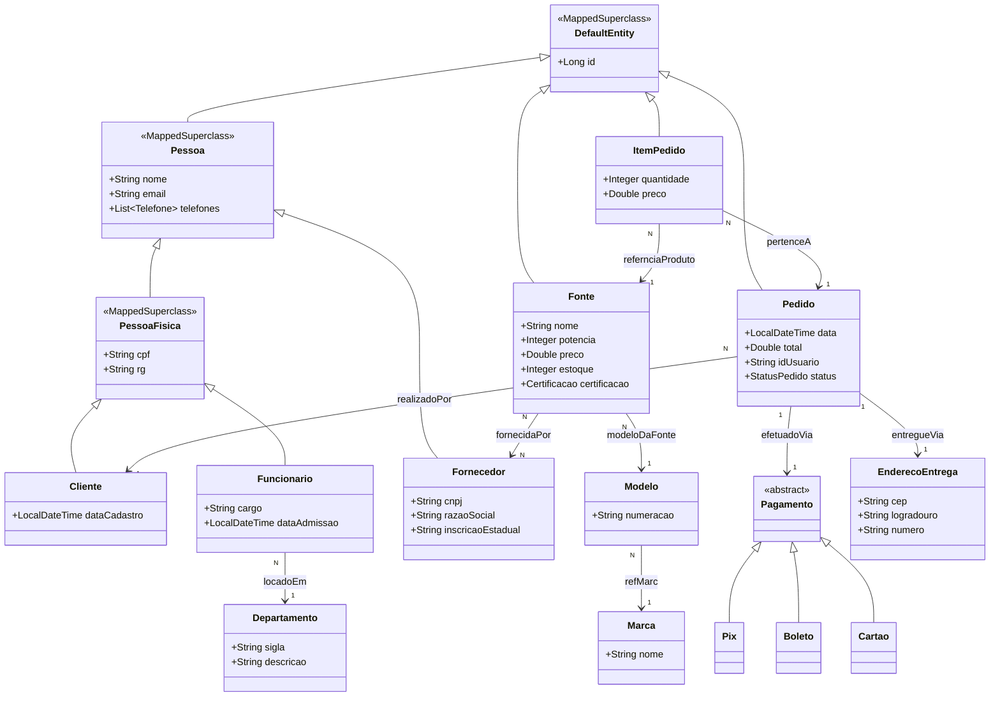
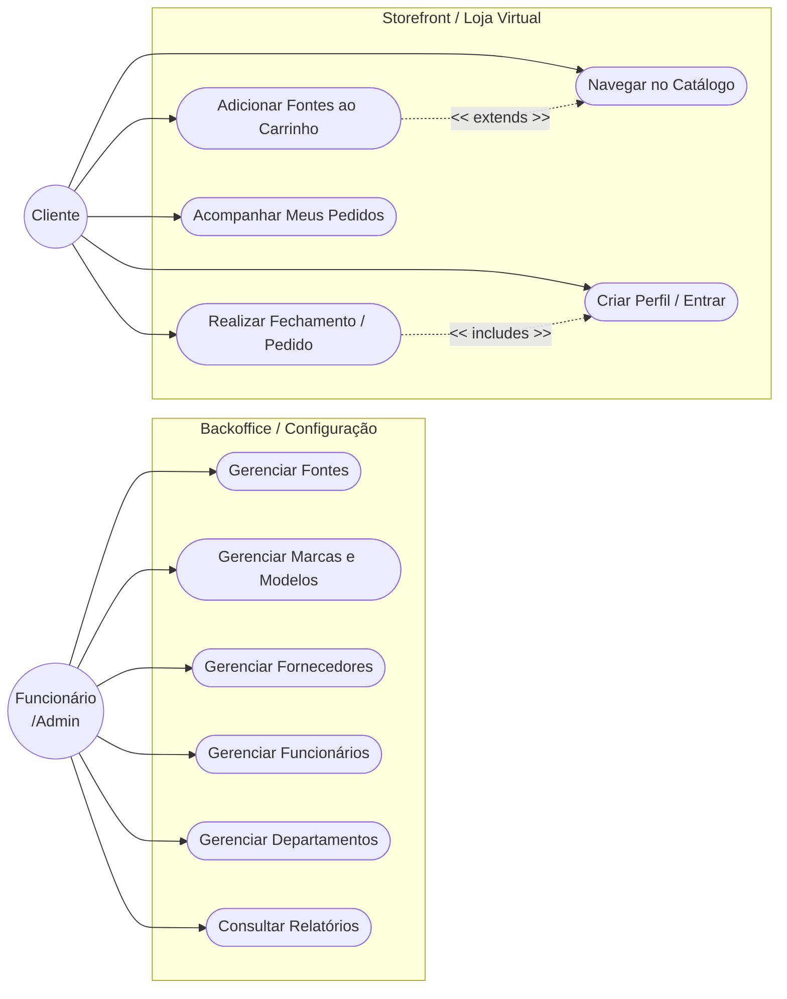

# Artefatos do Sistema - E-commerce de Fontes PC

Com base na estrutura atual percebida tanto no back-end (entidades, enumeradores e relações do banco) quanto no front-end (crud administrativos web implementados), formalizei este documento contendo os principais achados. Ele detalha todas as operações já suportadas e previstas pelo domínio mapeado.

---

## 1. Requisitos Funcionais

A especificação indica o que o sistema E-commerce deve fazer. Os requisitos foram divididos entre operações de administração da loja (Backoffice) e operações da Loja (Storefront).

### Módulo de Backoffice (Administrativo)
*   **RF01 - Gestão de Fontes:** O sistema deve permitir aos administradores o cadastro, edição, visualização e remoção (CRUD) de fontes de alimentação para computador, contendo detalhes como preço, potência, stock, modelo, marca e certificação.
*   **RF02 - Gestão de Fornecedores:** O sistema deve permitir o registo e a manutenção de fornecedores de componentes (CRUD com nome, razão social, CNPJ e Inscrição Estadual).
*   **RF03 - Associação Fonte-Fornecedor:** Uma mesma Fonte pode ser providenciada por múltiplos fornecedores, logo, o sistema deve permitir gerir essa lista associativa.
*   **RF04 - Gestão de Funcionários:** O sistema deve permitir criar gerenciar as fichas de funcionários, controlando o seu cargo, data de admissão e informações pessoais (CPF, RG e E-mail).
*   **RF05 - Gestão de Departamentos:** O sistema deve permitir categorizar os funcionários pelas suas áreas corporativas através do CRUD de Departamentos.
*   **RF06 - Gestão de Modelos e Marcas:** A aplicação dita que as fontes têm um relacionamento com um `Modelo`, e um modelo com uma `Marca`. O sistema garante o CRUD separadamente para organizar a estrutura do catálogo.
*   **RF07 - Paginação e Consulta:** Em todos os registos listados acima, o sistema deve oferecer buscas rápidas por nome/título, de preferência de forma paginada para poupar o carregamento de dados.

### Módulo Frontoffice (Loja e Clientes)
*   **RF08 - Gestão de Clientes:** O sistema deve permitir o cadastro de novos perfis para compra, convertendo Utilizadores em perfil Cliente.
*   **RF09 - Realização de Pedido:** O sistema deve permitir que um Cliente realize compras compondo um carrinho convertido num Objeto Pedido. Esse Pedido guarda dados do frete (Endereço de Entrega), do valor total, de quem comprou e do estado atual (novo, aguardando pagamento, processando etc.).
*   **RF10 - Gestão do Carrinho/Itens de Pedido:** O pedido deve conseguir agrupar múltiplos relatórios quantificáveis na base de uma peça para compor o total (ItemPedido guardando unidades x preço de prateleira).
*   **RF11 - Gestão de Pagamentos:** O sistema deve dar a capacidade de o cliente pagar via múltiplas abstrações como BOLETO, PIX e CARTAO.

---

## 2. Diagrama de Classes
Diagrama construído segundo o código Java encontrado na estrutura das entidades:

---

## 3. Diagrama de Caso de Uso
Abordagem das intenções do utilizador dependendo do seu perfil.

