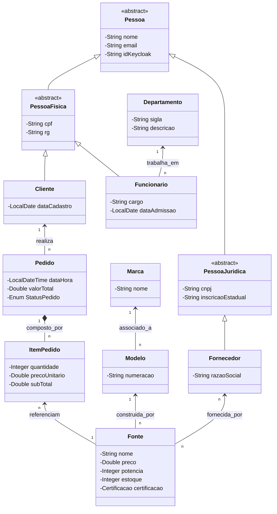
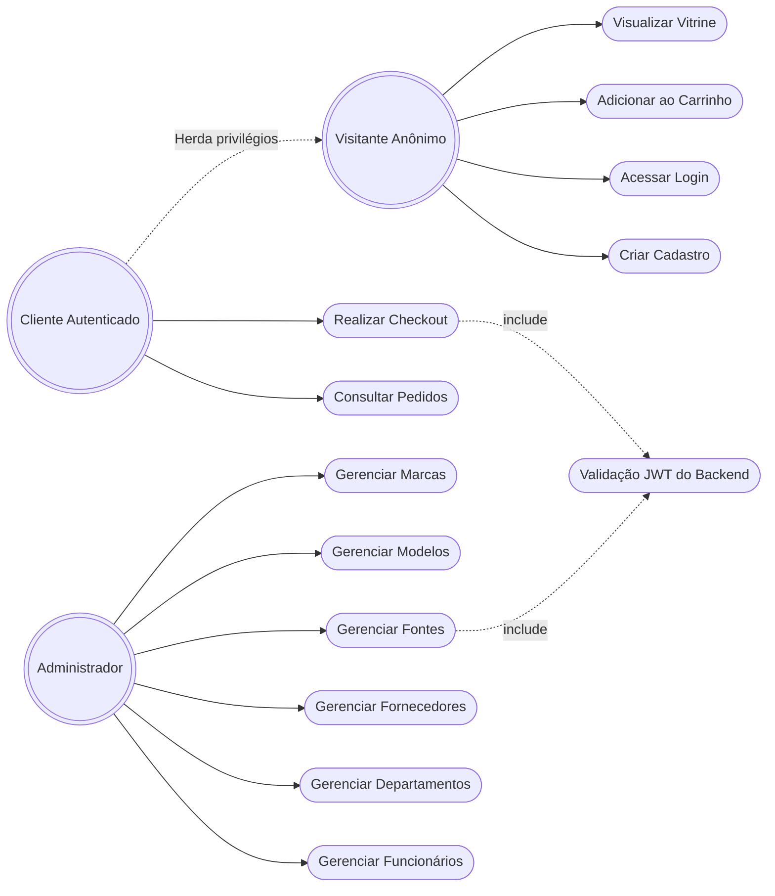

# E-commerce Fontes PC - Documentação do Sistema

Esta documentação foi elaborada baseada **exclusivamente nas funcionalidades e lógicas atualmente implementadas** no código-fonte (.java, .ts) do front-end e back-end do sistema. 

---

## 1. Requisitos Funcionais (RF)

Abaixo estão listadas as funcionalidades core desenvolvidas e operacionais no sistema. Elas respeitam a estrutura de paginação de back-end com busca dinâmica.

### 1.1 Controle de Acesso e Perfil de Usuários
- **RF01 - Cadastro de Clientes:** O sistema permite que novos visitantes se registrem, fornecendo nome, e-mail validado, senha forte, RG e CPF (tratando o Cliente como uma extensão/herança de Pessoa).
- **RF02 - Autenticação e Autorização:** O sistema possui integração com arquitetura JWT de autenticação. Usuários autenticam recebendo Tokens com funções baseadas em cargos (ex: Admin vs Cliente). 

### 1.2 Backoffice Administrativo (CRUDS ADM)
*Acesso restrito apenas aos Administradores do e-commerce.*
- **RF03 - Gerenciar Marcas:** O administrador pode Adicionar, Editar, Deletar e Consultar os fabricantes através de painel paginado.
- **RF04 - Gerenciar Modelos:** O administrador manipula os modelos de fontes conectando a cardinalidade (N:1) obrigatoriamente a uma Marca existente.
- **RF05 - Gerenciar Fontes:** CRUD central do Catálogo. O ADM cria Fontes atribuindo Preço, Estoque, Enumeração de Certificações, Modelo atrelado e seleção múltipla de Fornecedores daquela fonte (N:N).
- **RF06 - Gerenciar Departamentos:** Inserção e manutenção departamental interna.
- **RF07 - Gerenciar Fornecedores:** Gerenciar parceiros logísticos B2B com CNPJ (Herança Pessoa Jurídica).
- **RF08 - Gerenciar Funcionários:** Cadastro da folha com associação (1:N) ao seu respectivo Departamento.

### 1.3 Vitrine e Compras (Jornada do Cliente)
- **RF09 - Navegação na Vitrine:** Qualquer visitante acessa a vitrine em tempo real observando detalhes da fonte listada e se o estoque está zerado/esgotado ou não.
- **RF10 - Modulação de Carrinho:** O cliente pode adicionar produtos ao carrinho virtual e observar incrementos através dos Services isolados com Signal do Angular, decrementando virtualmente o alerta estoque conforme simula reservas.

---

## 2. Diagrama de Classes

Representação oficial das lógicas orientadas a objetos, isolando Heranças (Extends), Associações (N:N, 1:N) e Composições atualmente operantes nas models.

---

## 3. Diagrama de Casos de Uso

Mapeamento de quem interage com quais barreiras no ecossistema (Baseado no `AuthGuard` ativo que roteia usuários normais e admins separadamente).

> [!NOTE] 
> O modelo respeita à risca o fato de que toda a camada transacional de `Pedidos` em andamento está contruída (DTOs feitos, Models fechadas com Composição para os `ItensPedidos`) embora a tela gráfica para listagem dos pedidos dependa do avanço do módulo de pagamento nos próximos ciclos.
